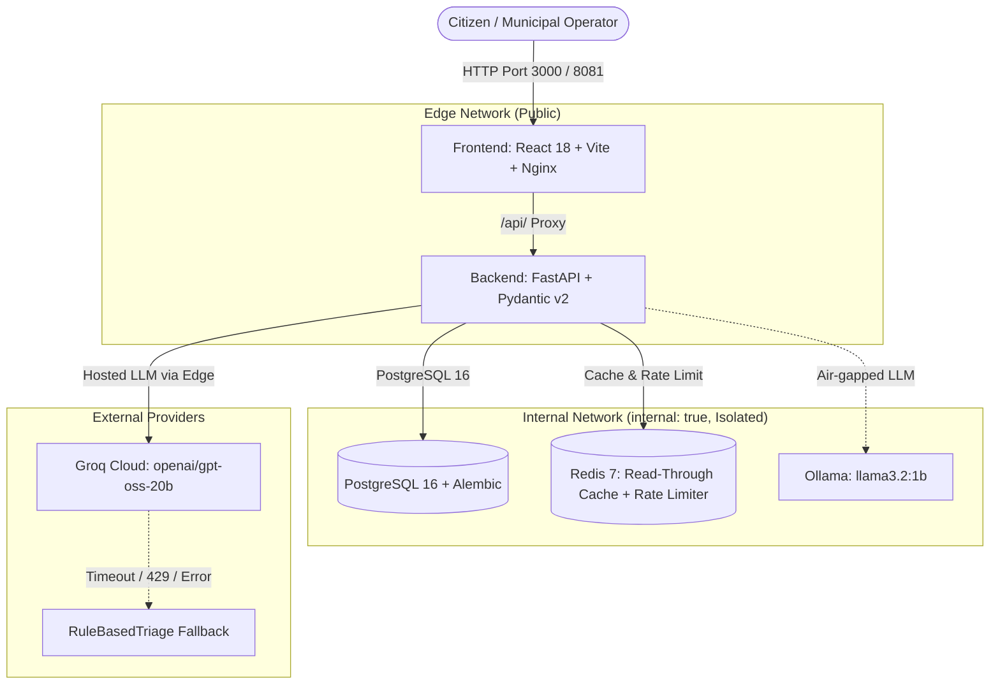

# CivicPulse 🏛️⚡

[](https://github.com/Sajawalkhan01/civicpulse/actions/workflows/ci.yml)
[](https://github.com/Sajawalkhan01/civicpulse/actions/workflows/cd.yml)
[](https://opensource.org/licenses/MIT)
[](https://www.python.org/)
[](https://react.dev/)
[](https://www.docker.com/)
[](https://kubernetes.io/)

**CivicPulse** is an end-to-end municipal complaint intake, resilient AI triage, and operations platform. It transforms unstructured, free-text citizen complaints into structured, prioritized, and categorized actions in real-time, operating across segmented Docker environments and autoscaling Kubernetes clusters.

---

## 1. The Problem
Municipalities worldwide face a broken complaint intake process: a citizen reports a burst water main flooding an entire street into a generic form. That free-text submission sits in an undifferentiated queue behind minor streetlight issues because nothing sorted them by urgency. By the time a human reads it, homes are flooded.

Dropdown menus fail because citizens misjudge urgency or select "Other" to speed through forms. The information is in the text—someone or something must read it.

CivicPulse solves this with **pluggable, fault-tolerant AI triage**: whether running hosted LLMs (Groq), air-gapped on-premise models (Ollama), or deterministic keyword rules, the system guarantees low latency, strict schema enforcement, rate-limited cost protection, and automated failover.

---

## 2. System Architecture

The following diagram illustrates the network segmentation, dual-network backend bridging, caching layer, and triage fallbacks:



---

## 3. One-Command Quickstart

### Prerequisites
- Docker Engine & Docker Compose (v2.20+)
- Git

### Run Locally (Docker Compose)
Clone the repository and run:

```bash
# 1. Clone repository
git clone https://github.com/Sajawalkhan01/civicpulse.git
cd civicpulse

# 2. Setup environment variables
cp .env.example .env

# 3. Launch the 5-container stack
docker compose up --build -d
```

- **Frontend Application:** Open [http://localhost:3000](http://localhost:3000)
- **Interactive OpenAPI Documentation:** Open [http://localhost:8000/docs](http://localhost:8000/docs)
- **Health / Readiness Probes:** `http://localhost:8000/health` & `http://localhost:8000/ready`

### Run on Kubernetes (k3d / Local Cluster)
```bash
# 1. Create local cluster with ingress port
k3d cluster create civicpulse --port "8081:80@loadbalancer"

# 2. Import locally built images
docker tag civicpulse-backend:latest ghcr.io/sajawalkhan01/civicpulse-backend:dev
docker tag civicpulse-frontend:latest ghcr.io/sajawalkhan01/civicpulse-frontend:dev
k3d image import ghcr.io/sajawalkhan01/civicpulse-backend:dev ghcr.io/sajawalkhan01/civicpulse-frontend:dev -c civicpulse

# 3. Deploy full Kustomize overlay
kubectl apply -k k8s/overlays/dev

# 4. Access via Ingress
curl http://localhost:8081/health
```

---

## 4. API Specification

| Method | Path | Status Codes | Description |
| :--- | :--- | :--- | :--- |
| `POST` | `/api/complaints` | `201`, `400`, `429` | Validates complaint, executes AI triage, persists to PostgreSQL. Rate limited via Redis token bucket. |
| `GET` | `/api/complaints/{id}` | `200`, `404` | Retrieves single complaint by UUID. |
| `GET` | `/api/complaints` | `200` | Paginated, filterable list by `status`, `category`, and `priority`. |
| `PATCH`| `/api/complaints/{id}/status`| `200`, `404`, `409` | Transitions state machine. Enforces explicit transition table (rejects invalid transitions with 409). |
| `GET` | `/api/stats` | `200` | Aggregates counts by category and priority. Redis-cached (TTL 30s) with `X-Cache: HIT/MISS` headers. |
| `GET` | `/api/meta/providers` | `200` | Observability surface returning active triage provider and last 20 execution latencies and fallback states. |
| `GET` | `/health` | `200` | Liveness probe. Confirms process is responsive without touching the database. |
| `GET` | `/ready` | `200`, `503` | Readiness probe. Validates PostgreSQL and Redis connectivity before serving traffic. |
| `GET` | `/metrics` | `200` | Prometheus metric scrape endpoint. |

---

## 5. Architectural Highlights & Compliance

- **4-Layer Architecture:** Pure separation between `routes/`, `services/`, `repositories/`, and `providers/`. No SQL queries exist outside `repositories/`.
- **State Machine Integrity:** Enforces transition table (`open` -> `in_progress` -> `resolved`, `open` -> `rejected`, `in_progress` -> `rejected`). Terminal states cannot transition.
- **Network Segmentation:** Database and Redis reside exclusively on an `internal: true` Docker network; internet-facing frontend cannot access the database directly.
- **Autoscaling:** HorizontalPodAutoscaler (HPA v2) scales backend pods dynamically between 2 and 10 replicas targeting 60% CPU utilization.
- **Immutable Delivery:** Releases deploy by immutable git commit SHA and image digests with Syft SBOM generation.

---

## 6. Architecture Decision Records (ADRs)
- [ADR 0001: Pluggable TriageProvider Interface](docs/adr/0001-provider-interface.md)
- [ADR 0002: Frontend Runtime Configuration & Build-Once-Deploy-Many](docs/adr/0002-frontend-runtime-config.md)
- [ADR 0003: Deployment by Immutable Commit SHA and Digest](docs/adr/0003-deploy-by-sha.md)
- [ADR 0004: PII and Data Governance in AI Triage](docs/adr/0004-pii-and-data-governance.md)

---

## 7. License
Distributed under the MIT License. See [LICENSE](LICENSE) for more information.
